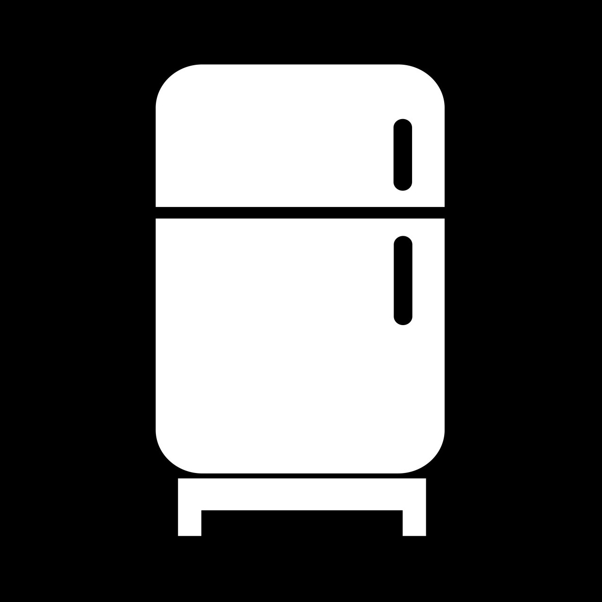

# Expiry Bot

This bot helps users keep track of the expiry dates of their items. It is intended to be used for food products, but can
also be used for other items with expiry dates such as medications or documents.

## Features

- Add items with expiry dates
- View all items with their expiry dates
- Delete items
- Receive notifications for items that are about to expire

## Commands

The primary commands for interacting with the bot are implemented through the custom keyboard buttons:

- Add: Start the process of adding a new item with its expiry date.
    - The bot will prompt for the item name and then the expiry date.
- List: View all items along with their expiry dates.
    - The bot will display a list of items sorted by their expiry dates.
- Remove: Remove an item from the list.
    - The bot will provide a list of items through the custom keyboard for deletion.

"stop" is also supported by the bot in all states in order to abort the current operation and reset to an idle state.

## Notifications

The bot will send a notification to all users on both the day before and the day of an item's expiry date at 10am, as
well as every day after the item as expired. This is currently not configurable.