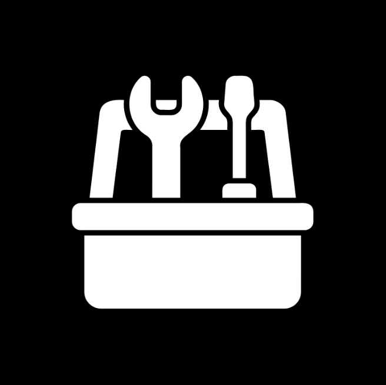

# Tools Bot

The bot provides various simple utilities, a toolbox if you will. These are miscellaneous features that don't fit into
any category but are useful on their own (to me at least).

## Features

- **Power meter**: Consumes a video of a power meter with a blinking indicator for power consumption and returns the
  power
  consumption rate.
    - This works with power meters with a red LED that blinks at 1Wh per impulse.
- **Check estimate**: Takes an estimated time and checks it against the actual time taken to perform an operation.
    - Useful for checking time estimates for tasks such as software builds or cooking.
- **Occupancy**: Manually record and retrieve occupancy of a location.
    - Designed with a gym in mind, but can be used for any location where occupancy tracking is useful.

## Commands

The primary command for interacting with the bot is implemented through the custom keyboard buttons:

- Power meter: Start the process of analyzing a power meter video.
    - The bot will prompt for a video file of the power meter.
- Check estimate: Start the process of checking an estimated time.
    - The bot will prompt for an estimated time in minutes. The estimate can be later checked against the actual time
      taken by sending "done" when the operation is complete.
- Occupancy: Record or retrieve occupancy information.
    - The bot will prompt for the current occupancy number or a day to retrieve occupancy for.
